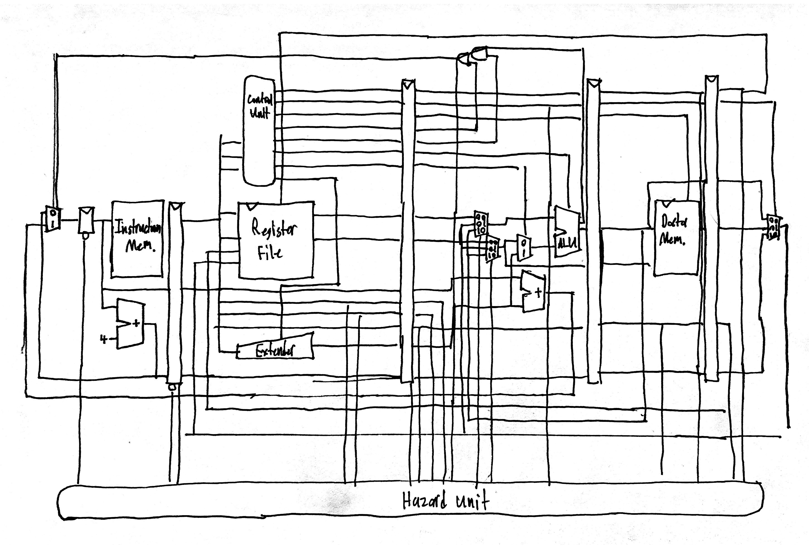
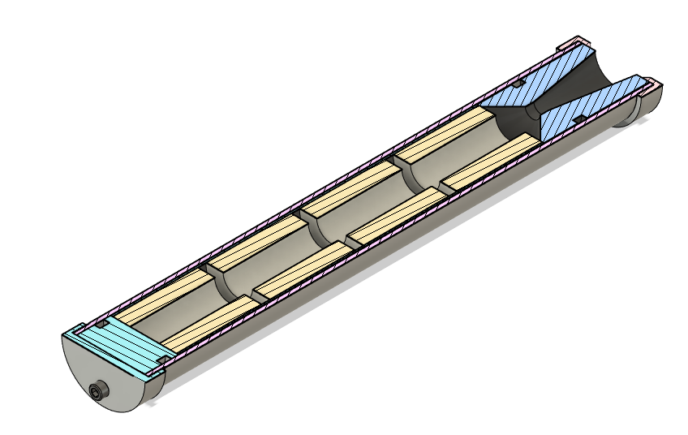
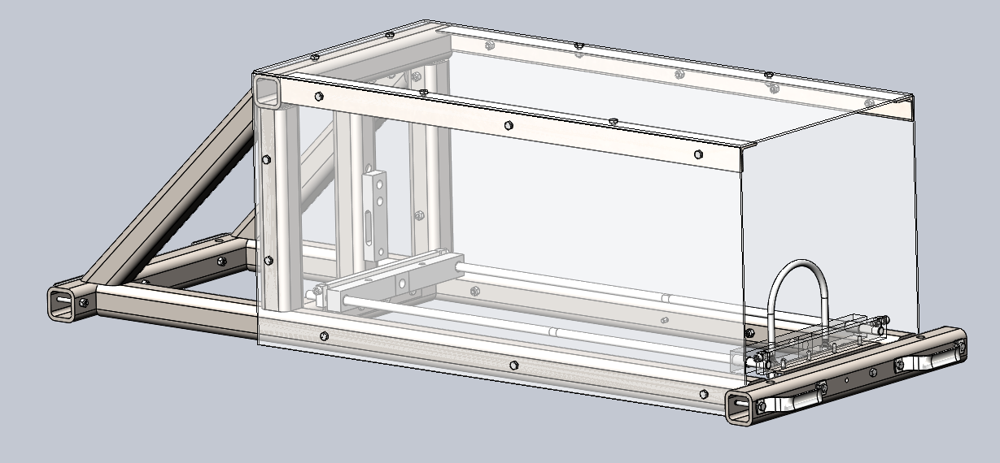

# Projects

## Pipelined RISC-V CPU (WIP)

I designed a pipelined RISC-V CPU in System Verilog for my computer architecture class final project. This processor supports almost all I, S, R, B, and J instructions for the RV32I instruction set. Down below, you can explore the repository that includes all of the code for this project!
 
[Pipelined RISC-V CPU Repository](https://github.com/MarcEftimie?tab=repositories)
  
Before getting into any System Verilog, I always draw sketches to validate my understanding of digital systems. Usually, I'll start with general block diagrams and then add details (mostly muxs in this case) as I go. Here are one of those sketches.

  

## Analog Circuitry

If I have any spare time from classes, I usually use it by tinkering with personal projects relating to analog circuitry. Of the projects that I've documented, I've compiled a few here to share.
  

### Blood / Heart Related Sensing

Since my school had extra stock of blood / heart sensors, I decided to design circuits to filter out the desired signals. These more practical projects helped me better understand many analog topics including RC filters, op amps, bode plots, reactance, etc.
 
 
Electrocardiogram (EKG):
 
EKG's essentially measure the voltage across certain parts of your body which makes them a great way to measure a pulse.

  
Pulse Oximeter:
 
Pulse Oximeter sensors output a voltage depending on the light that shines through your finger; they're used for measuring blood oxidation.

  
Ballistocardiogram:
 
By using a scale as my sensor, I made a circuit that can measure someone's pulse just by having them stand on it. This is because your heart applies a small (but detectable) downwards pressure when it pumps.
 

 

## Solid Rocket Engine

This year I had the opportunity to lead the Olin Rocketry Engine sub-team. My team is responsible for developing Olin Rocketry's proprietary propulsion system; this includes designing each part that goes into a solid rocket engine, making our own fuel, and settings up testing rigs to gather data from test launches. In a few weeks, my team has designed a completely new engine casing along with integrating new pressure and force transducers compared to last year's design. Currently, we are in the process of machining parts to get ready for a test launch happening in January.
  
The Phobos V3 Engine:

  
Test Launch Stand:

  
